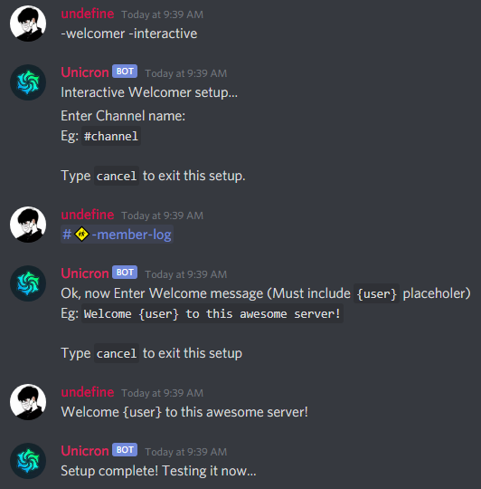
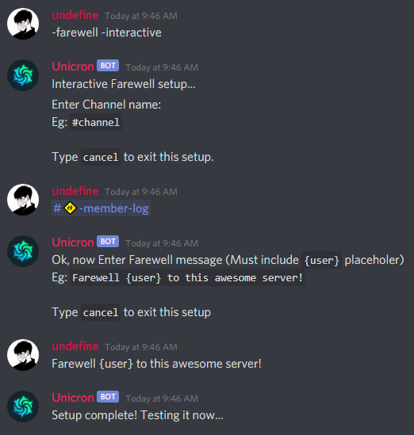

# settings

## Settings

### config

Configure Unicron's settings for this server.

Required Permissions:

* User Permission : `Server Administrator`
* Bot Permissions : `BAN_MEMBERS`, `MANAGE_ROLES`, `MANAGE_MESSAGES`, `MANAGE_CHANNELS`, `KICK_MEMBERS`

Aliases: `conf`

Keys:

* `prefix` - The prefix of Unicron for the current server/guild.
  * Default : `?` 
* `moderatorRole` - The Moderator Role of the current server/guild.
  * Default : `none`
* `adminRole` - The Administrator Role of the current server/guild.
  * Default : `none`
* `mutedRole` - The Muted role of the current server/guild.
  * Default : `none`
* `modLogChannel` - The Moderation Logs Channel of the current server/guild.
  * Default : `none`
* `autoModeration` - Whether autoModeraion is on/off for the current server/guild.
  * Default : `off`
* `autoModAction` - The action where `autoModeration` is gonna trigger.
  * Default : `MUTE`
  * Actions : `MUTE`, `KICK`, `SOFTBAN`, `BAN`
* `maxWarnTreshold` - The Maximum amount of warns. If exceeded. the `warnTresholdAction` is triggered.
  * Defaukt : `0` \(Disabled\)
* `warnTresholdAction` - The action where `maxWarnTreshold` is gonna trigger.
  * Default : `MUTE`
  * Actions : `MUTE`, `KICK`, `SOFTBAN`, `BAN`
* `warnActionExpiresOn` - The duration of the `warnTresholdAction`. excludes `KICK`
  * Default : `0s`
* `warningExpiresOn` - idk. _don't use this yet, i still don't know how to implement this ;-;_

Usages:

```bash
$ config view
$ config view [Page]
$ config set [Key] [...Value]
$ config reset [Key]
$ config reset all
```

### automod

Toggles AutoModeration on the server!

Required Permissions:

* User Permission : `Server Administrator`
* Bot Permissions : `BAN_MEMBERS`, `MANAGE_ROLES`, `MANAGE_MESSAGES`, `MANAGE_CHANNELS`, `KICK_MEMBERS`

### noswear

Toggles Swear Filter module.

Required Permissions:

* User Permission : `Server Administrator`
* Bot Permissions : `MANAGE_MESSAGES`, `BAN_MEMBERS`, `MANAGE_ROLES`, `MANAGE_MESSAGES`, `MANAGE_CHANNELS`, `KICK_MEMBERS`

### invitefilter

Toggles Invite Filter module.

Required Permissions:

* User Permission : `Server Administrator`
* Bot Permissions : `MANAGE_MESSAGES`, `BAN_MEMBERS`, `MANAGE_ROLES`, `MANAGE_MESSAGES`, `MANAGE_CHANNELS`, `KICK_MEMBERS`

### welcomer

Welcomer configuration module!

Required Permissions:

* User Permission : `Server Administrator`
* Bot Permissions : `SEND_MESSAGES` for the specific channel.

Flags:

* `-interactive` - for an interactive setup.

Keys:

* `channel` - The Welcomer Channel where all join messages will be sent.
* `message` - The Message format.
* `enable` - Enables welcomer module.
* `disable` - Disables welcomer module. 

Usages:

```bash
$ welcomer -interactive
$ welcomer channel [ChannelMention]
$ welcomer message [...Message]
$ welcomer [enable|disable]
```

## 

### farewell

Farewell configuration module!

Required Permissions:

* User Permission : `Server Administrator`
* Bot Permissions : `SEND_MESSAGES` for the specific channel.

Flags:

* `-interactive` - for an interactive setup.

Keys:

* `channel` - The Farewell Channel where all farewell messages will be sent.
* `message` - The Message format.
* `enable` - Enables farewell module.
* `disable` - Disables farewell module. 

Usages:

```bash
$ farewell -interactive
$ farewell channel [ChannelMention]
$ farewell message [...Message]
$ farewell [enable|disable]
```

## 

### verification

Member Verification module configuration.

Required Permissions:

* User Permission : `Server Administrator`
* Bot Permissions : `SEND_MESSAGES`, `ADD_REACTIONS`, `MANAGE_MESSAGES` for the specific channel and `MANAGE_CHANNELS`, `MANAGE_ROLES`.

Flags:

* `-enable` - Enables Member Verification Module.
* `-disable` - Disable Member Verification Module.

Usages:

```bash
$ verification (Interactive Setup)
$ verification [-enable|-disable]
```

